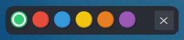

# WindowMux

A Windows desktop utility for organizing your workspace using color-coded groups. Assign windows to different color zones and quickly switch between "workspaces" by showing only the windows assigned to the active color.



## Features

- **Dynamic Color Modes**: Configure up to 9 color workspaces via JSON config
- **Master Color**: First color in config shows all windows (default: Green)
- **Minimize/Restore**: Hides windows by minimizing (preserves position)
- **Auto-Assignment**: New windows join the current active color mode
- **Keyboard Shortcuts**: Alt+1 through Alt+9 for quick switching
- **Draggable Overlay**: Small, always-on-top controller bar
- **Optional Elevation**: Choose whether to run as admin on first launch

## Requirements

- Windows 10/11
- .NET 8.0 Runtime
- Administrator privileges (optional, for managing elevated windows)

## Installation

Download the latest release or build from source:

```powershell
cd src/WindowMux
dotnet build --configuration Release
```

## Configuration

Settings are stored in `appsettings.json` next to the executable:

```json
{
  "ElevatedMode": false,
  "Colors": [
    { "Id": "green", "Name": "Green", "R": 46, "G": 204, "B": 113 },
    { "Id": "red", "Name": "Red", "R": 231, "G": 76, "B": 60 },
    { "Id": "blue", "Name": "Blue", "R": 52, "G": 152, "B": 219 }
  ]
}
```

- **ElevatedMode**: `true` = run as admin, `false` = normal mode, `null` = ask on first run
- **Colors**: First color is always the "master" (shows all windows)

## Keyboard Shortcuts

| Shortcut | Action |
|----------|--------|
| Alt+1 | Switch to first color (master/show all) |
| Alt+2 | Switch to second color |
| Alt+3 | Switch to third color |
| ... | ... |
| Alt+9 | Switch to ninth color |

## Usage

1. Launch WindowMux (first run will ask about elevation preference)
2. A floating bar appears with colored circles
3. Click a color or press Alt+1/2/3... to switch workspaces
4. The active color shows a white ring indicator
5. Drag the bar by its center gap area
6. Hover over colors to see their names

### Workflow Example

1. Start in Green mode (shows everything)
2. Switch to Red, open your work apps
3. Switch to Blue, open your personal apps  
4. Now Alt+2 (Red) and Alt+3 (Blue) toggles between contexts!

## Logs

Debug logs are written to:
```
%LocalAppData%\ScottReece.WindowMux\log.txt
```

## Architecture

```
src/WindowMux/
├── Elevation/     - UAC detection and relaunch
├── Interop/       - Win32 P/Invoke
├── Logging/       - File-based logger
├── Models/        - Config and window models
├── Services/      - Core business logic
└── UI/            - WinForms overlay
```

## Known Limitations

1. **UWP Apps**: Some modern apps may have reduced compatibility
2. **Fullscreen Games**: Exclusive fullscreen may not minimize properly
3. **System Dialogs**: UAC prompts and system dialogs are excluded
4. **Session-Only**: Window assignments reset when app closes
5. **Max 9 Hotkeys**: Only Alt+1 through Alt+9 supported

## License

MIT
